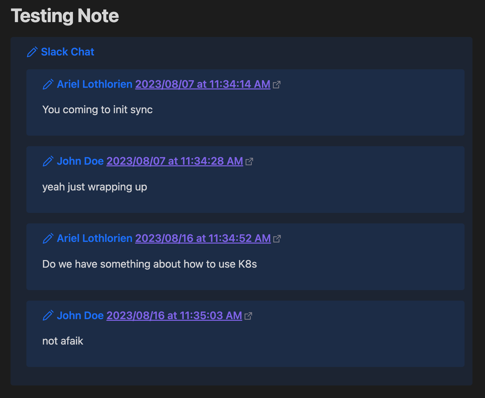

# Slack Paste Cleaner

Commands for Pasting from slack in a clean method with backlinks to slack messages.

## Commands

### Clean Slack Data from Clipboard

Reads the content of the clipboard and if it contains html data that looks like slack data it will create a region called Slack Chat that has sub regions for all the messages in the copy paste.

## Current Maintainers

- [eforen](https://github.com/eforen)

## Contributors

- [eforen](https://github.com/eforen)